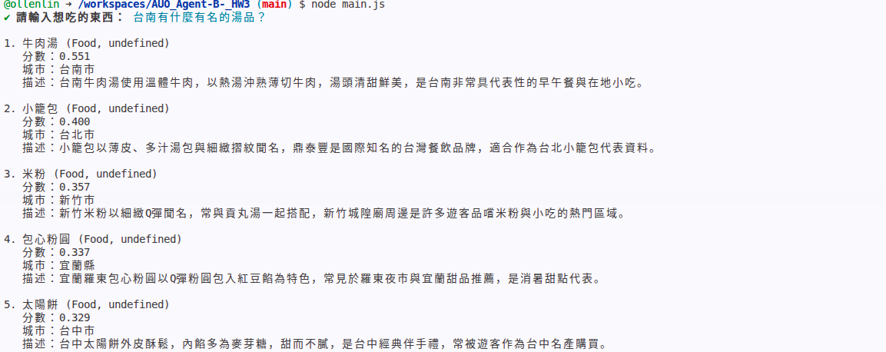
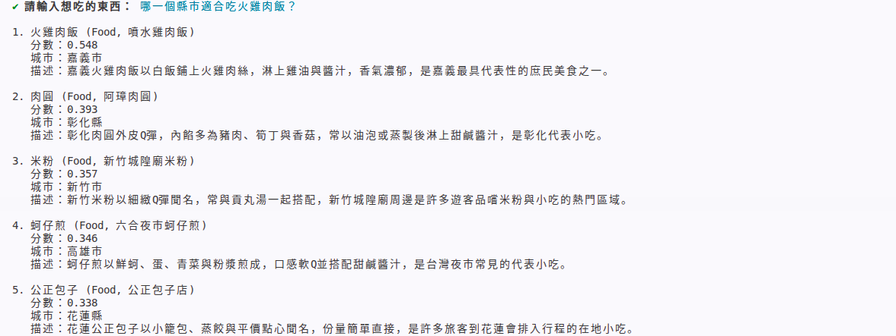
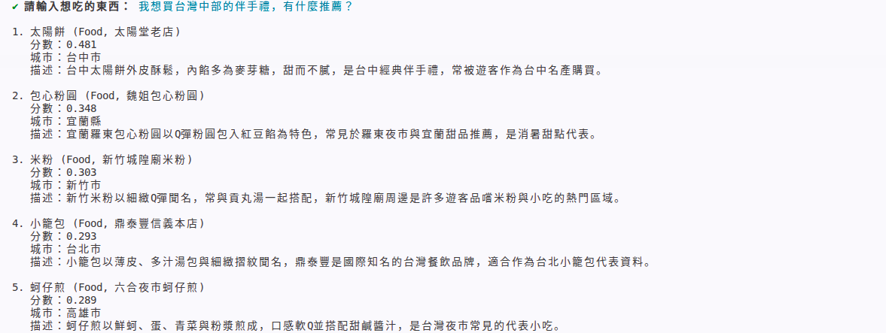

# 作業 3：建立迷你知識庫

## 1. 任務說明

本作業使用課程教的 Embeddings 與向量資料庫 Qdrant，建立一個小型知識庫，並測試語意搜尋功能。

本次主題選擇：

**台灣美食介紹**

知識庫內容包含 10 筆台灣各縣市代表美食資料，例如牛肉麵、小籠包、台南牛肉湯、嘉義火雞肉飯、台中太陽餅等。
每筆資料包含美食名稱、縣市、代表名店、分類與描述，並透過 Embedding 轉換成向量後存入 Qdrant。


### 測試 1：查詢台南湯品

問題：

```text
台南有什麼有名的湯品？
```

預期結果應與台南牛肉湯相關。

結果截圖：



---

### 測試 2：查詢嘉義代表美食

問題：

```text
嘉義最有代表性的飯類小吃是什麼？
```

預期結果應與嘉義火雞肉飯相關。

結果截圖：



---

### 測試 3：查詢台灣伴手禮

問題：

```text
我想買台灣中部的伴手禮，有什麼推薦？
```

預期結果應與台中太陽餅相關。

結果截圖：



